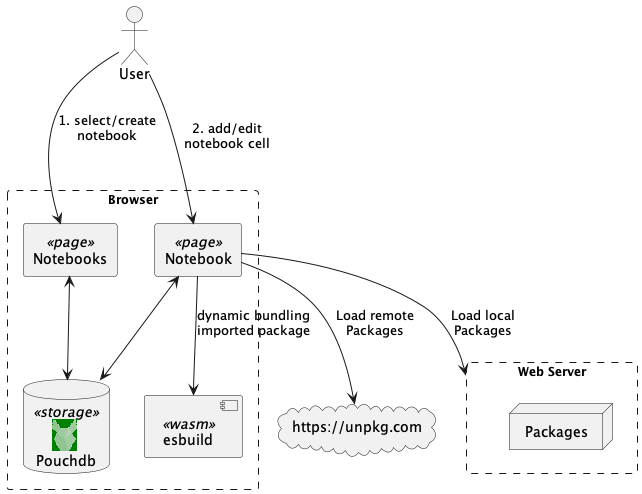
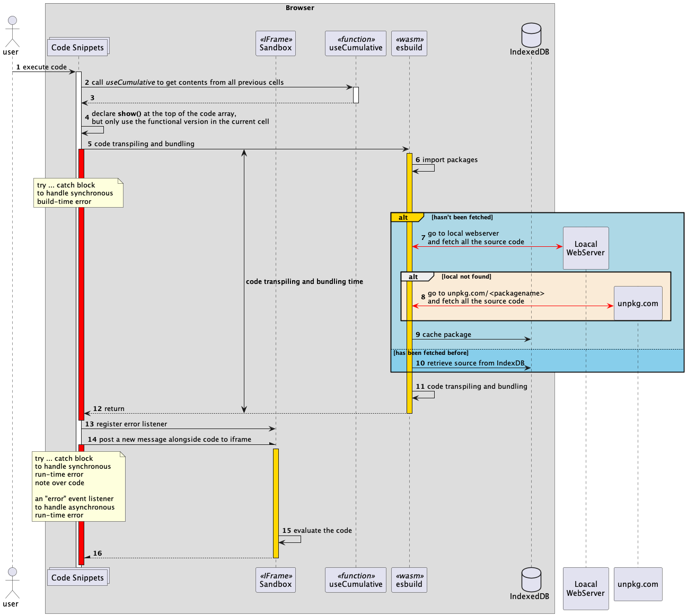

# JS NOOTEBOOK

A **browser-based interactive notebook for JavaScript and TypeScript**, similar to **Jupyter Notebook**.
At beginning I forked by the awesome [qiushiyan/js-notebook] project, afterthat I've extended the original project with new features. Below a summary of the main differences :

 Feature | qiushiyan/js-notebook | bsorrentino/js-notebook
 ---- |  ---- | -----
   Support **multiple notebooks** | No | Yes 
   Support **local package fetching** | No | Yes
   Support **extension model** | No | Yes

## Architecture

## Technologies

The app uses a multi-package setip with the help of [lerna]. Inside the [packages](packages) folder, there are [`cli`](packages/cli) for digesting command-line arguments and pass it down to server, [`server`] which sets up an express server for I/O operations , and [`server`], which implements the actual user interface and code execution logic.

The **cli** and **local serve**r** are implemented using [`commander`] and [`express`]. The frontend is mainly put together with [React] and [TypeScript], with

* [`Redux`] and [`Redux Toolkit`]: for state management and asynchronous logic via Redux Thunk
* [`esbuild-wasm`]: for code transpiling and bundling inside the browser

## Challenges

### 1. Code bundling and execution inside the browser

There are many options for bundling, webpack, rollup and esbuild, to name a few. However, the bundling process traditionally happens in the server, which calls for a much more complicated implmentation. Luckily, the WebAssembly version of esbuild, [`esbuild-wasm`] enables code bundling inside the browser.

To allow users to import any npm module without haivng to download it locally, the app need a way of telling [`esbuild-wasm`] to first resolve the repository where these source files are stored, and then fetch the source code, a job [plugins](packages/client/src/bundler/plugins) are designed to do. Then esbuild-wasm will take care of the transpiling and bundling process. Moreover, once a package has been fetched, certain bundling instructions containing its source has been stored will be stored in IndexdDB, which saves fetching for the second time.

After code bundling is done, we need to execute the bundle. It is undesirbale to allow user-provided code to run directly inside the current DOM, since they might result in errors or mutate the dom and evenutally crash the app. There also might be malicious code provided by other user trying to reach personal data like cookies.

To solve this, the app runs JavaScript in a child `iframe`, so that all the code will be executed in the context of a child html page instead, and direct communication between the iframe and the other parts of the app can be blocked. Inside the iframe, an `message` event listener has been added to evaluate any code attached to it. Whenever an input state is updated and esbuild returns the bundled code, we trigger the message event by with the `postMessage` api and let the iframe `eval` the bundled code.

### 2. Error handling

There are different types of errors that need to be treated differently, since the app would have to provide some consistent error feedback inside the iframe.

- bundle-time error and run-time synchronous error : can simply be handlded with a `try ... catch` block inside bundlers or the evaluation process in the iframe

- run-time asynchronous error: needs to add an extra error event listener in the iframe, because `eval` will not throw an error if the code has some asynchronous logic

### 3. Cumulative code execution and custom built-in function

In an interactive enviroment, a user typically codes in an tentative and explorative manner, so it's important to keep multiple code cells connected. Whenever the app runs a code cell, a custom hook [`useCumulative`] is called to collect code from all previous cells into a "cumulative code array" that is joined, bundled and executed altoghter.

There is also a built-in `show()` function that display values in the DOM of the preview window. That function is defined at the top of the cumulative code array. But with cumulative exectuion, DOM operations from previous cells will intervene that of the current cell. The solution is to declare `show()` once at the top, and feed in different contents inside its function body, so that only the current cell will receive a functional version with all previous cells receiving an empty function body.

## Code Execution Process

With all that, the following diagram summarises the code execution process inside a single notebook

# References 

* Inspired by project [qiushiyan/js-notebook]

[lerna]: https://github.com/lerna/lerna
[`esbuild-wasm`]: https://www.npmjs.com/package/esbuild-wasm
[qiushiyan/js-notebook]: https://github.com/qiushiyan/js-notebook
[React]: https://www.npmjs.com/package/react
[TypeScript]: https://www.npmjs.com/package/typescript
[`commander`]: https://www.npmjs.com/package/commander
[`express`]: https://www.npmjs.com/package/express
[`Redux`]: https://www.npmjs.com/package/redux
[`Redux Toolkit`]: https://www.npmjs.com/package/@reduxjs/toolkit
[`useCumulative`]: packages/client/src/hooks/index.ts
[`server`]: packages/server